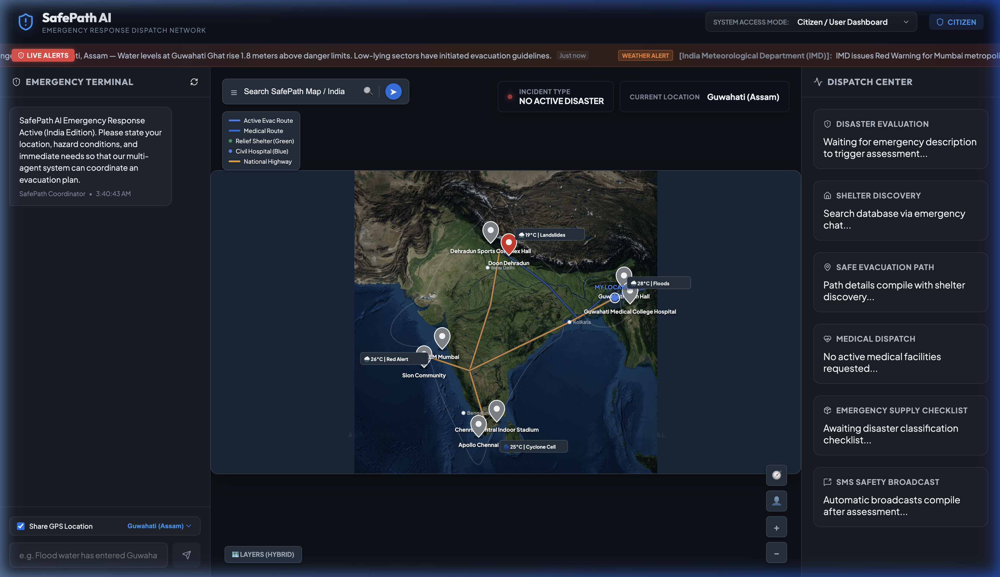
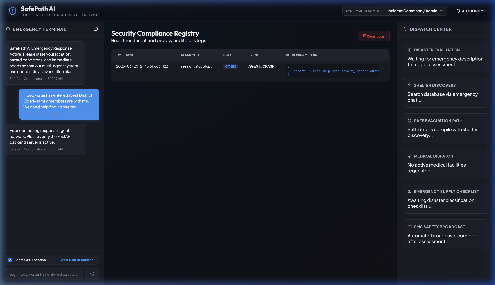

# SafePath AI - Multi-Agent Emergency Response & Evacuation Assistance Platform

SafePath AI is an emergency-response platform built on the **Google Agent Development Kit (ADK)** and **FastAPI** with a modern **React dashboard** frontend. It serves as a mock command center and user portal for citizens and emergency authorities to coordinate safety assessment, shelter discoveries, navigation routing, medical dispatch, supply checklists, and broadcast alerts during severe disaster scenarios (floods, earthquakes, fires, etc.).

This project is built for the **"Agents for Good" track of the Kaggle AI Agents Capstone Project**.

---

## 📖 Key Capabilities

### 1. Collaborative Multi-Agent Mesh
Exposes 6 specialized AI sub-agents orchestrated by a central coordinator:
* **Disaster Assessment Agent**: Evaluates descriptions & warnings to classify incident severity.
* **Shelter Discovery Agent**: Queries open shelter coordinates and available slots.
* **Safe Route Agent**: Mapped pathways avoiding hazard road blockages.
* **Medical Assistance Agent**: Dispatches hospital registries and provides first-aid guides.
* **Emergency Supply Agent**: Compiles custom checklists based on disaster type.
* **Communication Agent**: Pre-drafts safety SMS broadcasts and logging tickets.

### 2. Privacy & Role-Based Access Security
* **User Location Consent**: Evaluated by a custom `AuditLoggerPlugin`. If a user opts out of sharing location coordinates, the platform masks/obfuscates location values before passing them to internal tools.
* **Simulated Roles**: Citizenship dashboards, Volunteer portals, Emergency Responder views, and Administrative Command lines. 
* **JSONL Threat Logging**: Writes compliance security trails into `audit_log.jsonl`.

### 3. Integrated Mock MCP Server
Provides standard tools connecting to local databases matching:
* Weather warnings (`get_weather_conditions`)
* Location pathfinding (`get_evacuation_routes`)
* Operational hospitals (`search_hospitals`)
* Shelter registries (`search_shelters`)
* Helpline directories (`get_emergency_contacts`)

---

## 🤖 Multi-Agent Workflow & System Architecture

SafePath AI is powered by a collaborative multi-agent mesh using the Google Agent Development Kit (ADK). The central coordinator handles standard user queries and dispatches specialized sub-agents sequentially to construct a complete emergency response package.

### Agent Workflow Diagram

Below is the workflow showing the sequential dispatch, tool execution via the local MCP server, state propagation, and security auditing:

```mermaid
graph TD
    User([Citizen / User]) -->|1. Submit Incident/Request| Coord[Coordinator Agent]
    
    subgraph Multi-Agent Mesh (Google ADK)
        Coord -->|2. Dispatch| DAA[Disaster Assessment Agent]
        DAA -->|3. Query Weather/Alerts| MCPS[MCP Server]
        DAA -->|4. Save Assessment| State[(Shared Session State)]
        
        Coord -->|5. Dispatch| SDA[Shelter Discovery Agent]
        SDA -->|6. Search Shelters| MCPS
        SDA -->|7. Save Shelter Info| State
        
        Coord -->|8. Dispatch| SRA[Safe Route Agent]
        SRA -->|9. Calculate Routes| MCPS
        SRA -->|10. Save Route Info| State
        
        Coord -->|11. Dispatch| MAA[Medical Assistance Agent]
        MAA -->|12. Find Hospitals & ER| MCPS
        MAA -->|13. Save Medical Info| State
        
        Coord -->|14. Dispatch| ESA[Emergency Supply Agent]
        ESA -->|15. Generate Checklist| State
        
        Coord -->|16. Dispatch| CA[Communication Agent]
        CA -->|17. Get Rescue Hotlines| MCPS
        CA -->|18. Save SMS & Alerts| State
    end
    
    subgraph Security & Audit Compliance
        State -->|Intercept state changes| ALP[AuditLoggerPlugin]
        ALP -->|Check consent & mask data| AuditLog[(audit_log.jsonl)]
    end
    
    Coord -->|19. Aggregate & Present| UI[React Vite Frontend]
    UI -->|Render route & weather overlays| User
```

### Detailed Execution Phase

1. **Incident Intake & Coordination**: The user submits their situation in the emergency chat dashboard (e.g., *"Guwahati river is rising rapidly and water is entering the ground floor"*). The `safepath_coordinator` receives the prompt, initializes the shared session state, and controls the execution flow.
2. **Disaster Assessment**: `disaster_assessment_agent` executes first. It queries the local MCP server's `get_weather_conditions` and `get_realtime_news` tools to check for NDMA/IMD alerts in the specified region. It determines the disaster type (e.g., Flood), sets the severity to *High/Critical*, and updates `disaster_assessment` in the shared state.
3. **Shelter Discovery**: `shelter_discovery_agent` is called. It uses `search_shelters` to locate the nearest active relief camp (e.g., *Guwahati Town Hall Shelter*) with available capacity and SDRF support.
4. **Safe Routing**: `safe_route_agent` retrieves the location coordinates and calculates a safe evacuation pathway (e.g., *Route Alpha Elevated Bypass*), checking for known hazard blockages using the `get_evacuation_routes` tool.
5. **Medical Triage**: `medical_assistance_agent` calls the `search_hospitals` tool to check for trauma centers/hospitals nearby (e.g., *Guwahati Medical College*), listing active emergency phone numbers and immediate disaster first-aid guides.
6. **Supply Checklist**: `emergency_supply_agent` compiles a customized list of survival gear and dry food rations (e.g., clean water, torches, biscuits, power banks) corresponding to the specific disaster type.
7. **Crisis Communication**: `communication_agent` uses `get_emergency_contacts` to find state disaster helpline numbers (e.g., *ASDMA control room*). It pre-drafts:
   * A family-facing short SMS with current location and safety status.
   * A formal rescue report for NDMA/SDRF responders.
8. **Compliance Logging**: The `AuditLoggerPlugin` hooks into the agent pipeline. If the user opts out of sharing location coordinates, the plugin automatically sanitizes, masks, and obfuscates latitude/longitude values before logging them to `audit_log.jsonl`, keeping the system compliant with privacy policies.
9. **Final UI Aggregation**: The coordinator aggregates all compiled sub-agent attributes into a structured markdown report, sending it to the frontend. The dashboard automatically parses the data to render active navigation pathways, custom weather indicators, map pins, and warning alerts directly on the satellite map visualization.

---

## 📂 Project Structure


```
safepath-ai/
├── app/
│   ├── agent.py         # Multi-agent orchestrations & model fallbacks
│   ├── audit_logger.py  # Custom ADK security AuditLoggerPlugin
│   ├── fast_api_app.py  # FastAPI app serving REST APIs & mounting frontend
│   └── mcp_server.py    # Python FastMCP server with mock databases
├── frontend/            # React client Vite configuration
│   ├── src/
│   │   ├── App.tsx      # Main application view with interactive SVG map
│   │   ├── index.css    # Custom glassmorphic dark-mode CSS stylesheet
│   │   └── main.tsx
│   ├── index.html       # Configured with SEO title & description
│   └── package.json     # Node configurations
├── tests/
│   └── eval/
│       └── datasets/
│           └── safepath_eval.json  # Multi-case disaster evaluation scenarios
├── audit_log.jsonl      # Compliance security audit trails (auto-generated)
├── pyproject.toml       # Python package dependencies
└── README.md            # Product documentation
```

---

## 🚀 Running SafePath AI Locally

### Prerequisites
1. **Python 3.10+** (managed with `uv`)
2. **Node.js** (for building the frontend client)

### Step 1: Install Dependencies
Install Python dependencies and Node modules:
```bash
# In safepath-ai/
agents-cli install

# In safepath-ai/frontend/
npm install
```

### Step 2: Set Environment Variables
Configure your local API credentials inside `safepath-ai/app/.env` (and `safepath-ai/.env`):
```env
GEMINI_API_KEY="YOUR_GEMINI_API_KEY_HERE"
MODEL_NAME="gemini-2.5-flash"
PORT=8000
```

### Step 3: Build the Frontend
Compile static frontend modules:
```bash
cd frontend
npm run build
cd ..
```

### Step 4: Run the Application
Start the FastAPI server. It mounts and serves the static production UI on port `8000`:
```bash
uv run uvicorn app.fast_api_app:app --host 0.0.0.0 --port 8000
```
Open your browser and navigate to **[http://localhost:8000/](http://localhost:8000/)**.

---

## 📊 Evaluation and Testing

To verify the agent logic against the local evaluation dataset:
```bash
agents-cli eval generate --dataset tests/eval/datasets/safepath_eval.json
agents-cli eval grade
```
*(Requires a valid `GEMINI_API_KEY` set in the environment variables).*

---

## 📸 Screenshots & Workflows

### 1. Google Maps Styled Interactive Evacuation Dashboard (India Edition)
Features a realistic Google Maps dark-mode style satellite background with custom weather icons showing real-time statistics (temperature, active warnings) by city and state, classic map pins, active navigation route overlays, and live alert news tickers pulling directly from NDMA/IMD warning feeds.



### 2. Security Compliance Registry (Admin Role)
Shows administrative logs of all transactions. It records agent starts, complete audit trails, masking consents, tool invocations, and warnings, keeping authorities fully audited.


